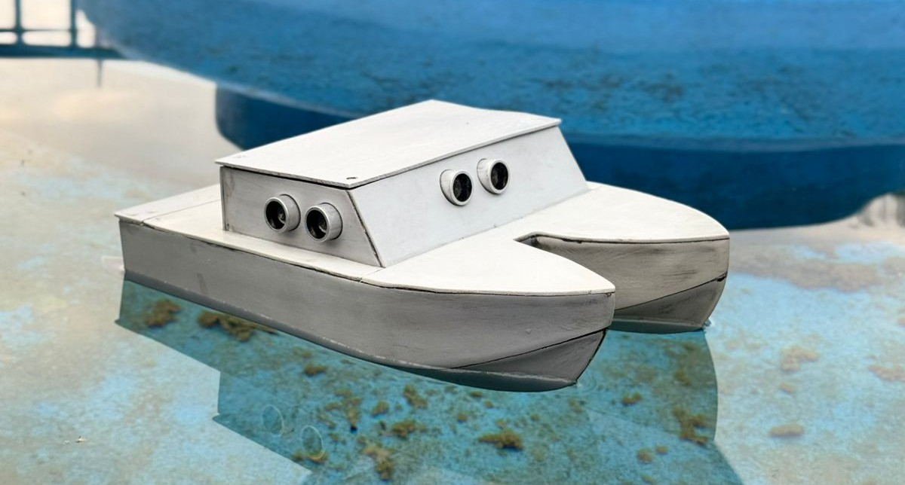
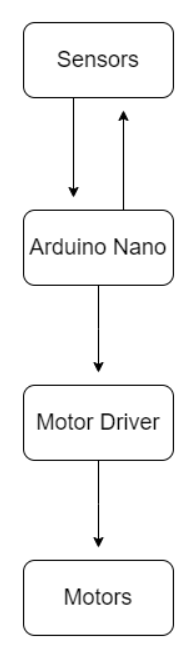
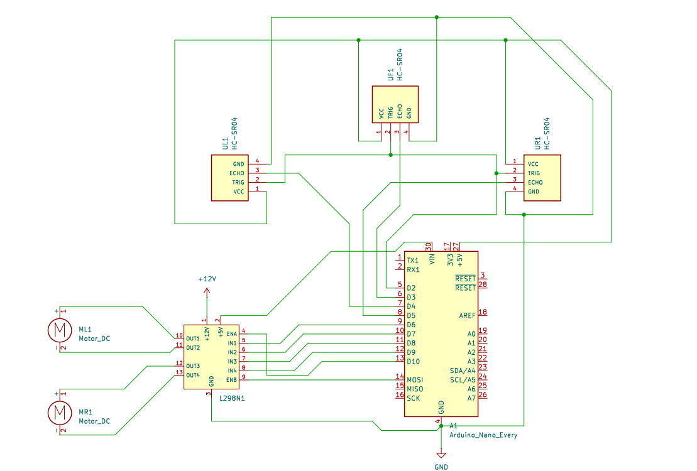
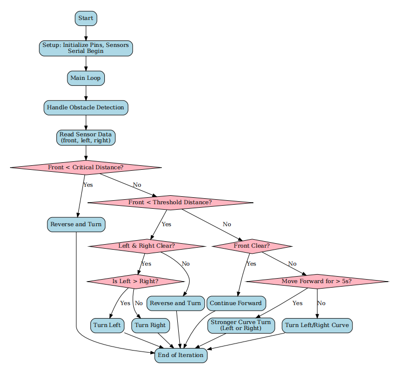
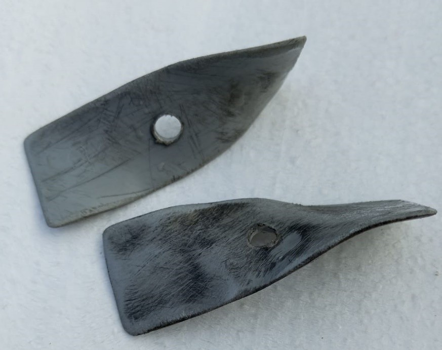

# Hydra: Autonomous Obstacle-Avoiding Marine Vehicle

<p align="center">
  
</p>

<p align="center">
  <strong>An intelligent autonomous boat system for competitive racing and marine navigation</strong>
</p>

<p align="center">
  
  
  
  
  
</p>

---

## 📖 Table of Contents

- [🎯 Overview](#-overview)
- [✨ Features](#-features)
- [🔬 Technical Specifications](#-technical-specifications)
- [🏗️ System Architecture](#️-system-architecture)
- [📋 Project Background](#-project-background)
- [🎯 Objectives](#-objectives)
- [📚 Literature Review](#-literature-review)
- [🔧 Related Theory](#-related-theory)
- [🛠️ Methodology](#️-methodology)
- [🎨 Project Gallery](#-project-gallery)
- [⚡ Installation & Setup](#-installation--setup)
- [🎮 Usage & Operation](#-usage--operation)
- [📊 Results & Analysis](#-results--analysis)
- [🔮 Conclusion & Future Work](#-conclusion--future-work)
- [📁 Project Structure](#-project-structure)
- [📚 Documentation](#-documentation)
- [👥 Development Team](#-development-team)
- [⚠️ Limitations & Scope](#️-limitations--scope)
- [📄 License](#-license)

---

## 🎯 Overview

The Hydra Autonomous Boat is a professional-grade marine vehicle specifically designed for the "Defying the Waves" competition organized by Robotics Club, IOE, Pashchimanchal Campus. Featuring real-time obstacle detection and avoidance capabilities, this system employs a sophisticated catamaran hull design combined with multi-sensor integration to deliver exceptional stability and hydrodynamic performance in dynamic aquatic environments.

Built around the Arduino Nano platform, Hydra demonstrates the practical application of autonomous navigation principles in cost-effective marine robotics, showcasing innovation in autonomous systems for maritime applications.

<p align="center">
  
  
  
</p>

---

## ✨ Features

| Feature | Description |
|---------|-------------|
| 🎯 Real-time Autonomous Navigation | Dynamic path planning with obstacle avoidance |
| 📡 Multi-directional Obstacle Detection | Ultrasonic sensor array for 360° environment awareness |
| 🚀 Intelligent Collision Avoidance | Predictive maneuvering with real-time decision making |
| ⚖️ Stable Catamaran Design | Double-hulled structure for optimal hydrodynamic performance |
| 🔧 Modular Control System | Magnetically accessible compartments for easy maintenance |
| ⚡ Dual Propulsion System | Two-fan configuration for precise speed and directional control |
| 🔄 Inertia Compensation | Advanced algorithms for improved trajectory management |
| 💡 Power-efficient Operation | Optimized for extended racing durations |

---

## 🔬 Technical Specifications

### Hardware Components

| Component | Quantity | Specification | Purpose |
|-----------|----------|---------------|---------|
| Microcontroller | 1× | Arduino Nano ATmega328 | Central processing unit |
| Ultrasonic Sensors | 3× | HC-SR04 (2-400 cm range) | Obstacle detection (Front, Left, Right) |
| Motor Driver | 1× | L2938N Dual H-Bridge | Motor control and power management |
| DC Gear Motors | 2× | 12V, 200 RPM, 1.5 kg-cm torque | Thrust generation |
| Propellers | 2× | Two-blade design | Efficient propulsion |
| Power System | 1× | Li-ion Battery Pack | System power supply |
| Hull Material | - | PVC Construction | Lightweight, durable structure |
| Magnets | Multiple | Neodymium | Removable cover securing |

### Performance Metrics

| Parameter | Specification |
|-----------|---------------|
| Obstacle Detection Range | 2 cm to 400 cm |
| Response Latency | < 100ms |
| Operating Voltage | 12V DC |
| Dimensions | 26 × 12 × 11 cm |
| Navigation Modes | Forward, Reverse, Left/Right Turns, Curve Navigation |
| Control Loop Frequency | 10Hz |

---

## 🏗️ Software Architecture

## 🎯 Modular Design Overview

The Hydra autonomous navigation system is built with a modular, object-oriented architecture that separates concerns and enables easy maintenance and scalability. The system follows a clear sensor → processor → actuator pipeline.

## 🔄 Core Data Flow

```
┌─────────────┐    ┌──────────────────┐    ┌──────────────────┐    ┌─────────────────┐
│   SENSORS   │    │   DATA MANAGER   │    │ NAVIGATION BRAIN │    │   MOTOR DRIVER  │
│             │    │                  │    │                  │    │                 │
│ • Front US  │────▶• Ultrasonic      │────▶• Obstacle        │────▶• Motor          │
│ • Left US   │    │   Manager        │    │   Avoidance      │    │   Controller    │
│ • Right US  │    │ • Distance Calc  │    │ • Decision Logic │    │ • Movement Exec │
└─────────────┘    └──────────────────┘    └──────────────────┘    └─────────────────┘
                                                                           │
                                                                  ┌────────┴────────┐
                                                                  │                 │
                                                             ┌─────┐           ┌─────┐
                                                             │Left │           │Right│
                                                             │Motor│           │Motor│
                                                             └─────┘           └─────┘
```

## 🧩 Core Components Breakdown

### 1. UltrasonicManager Class - The Sensory System

```cpp
// Responsible for all sensor operations
class UltrasonicManager {
    getFrontDistance();   // Front obstacle detection
    getLeftDistance();    // Left side monitoring  
    getRightDistance();   // Right side monitoring
    // Handles sensor calibration and error checking
}
```

### 2. ObstacleAvoidance Class - The Navigation Brain

```cpp
// Makes intelligent decisions based on environment
class ObstacleAvoidance {
    handleObstacleDetection();  // Main decision-making function
    logSensorData();           // Debugging and monitoring
    // Implements complex navigation algorithms
}
```

### 3. MotorController Class - The Movement Executor

```cpp
// Translates decisions into physical movements
class MotorController {
    moveForward();          // Straight line navigation
    turnLeft()/turnRight(); // Direction changes
    reverseAndTurn();       // Emergency maneuvers
    turnLeftCurve()/turnRightCurve(); // Smooth turning
    strongerCurveTurn();    // Aggressive avoidance
    // Manages motor speeds and timing
}
```

## 🧠 Intelligent Decision-Making Process

### Real-Time Navigation Logic

```cpp
void handleObstacleDetection() {
    // Step 1: Environment Scanning
    frontDist = getFrontDistance();  // What's ahead?
    leftDist = getLeftDistance();    // Clear on left?
    rightDist = getRightDistance();  // Clear on right?

    // Step 2: Situation Assessment
    if (frontDist < CRITICAL_DISTANCE) {
        // 🚨 EMERGENCY: Too close! Reverse and turn
        motorController.reverseAndTurn(leftDist, rightDist);
    }
    else if (frontDist <= WARNING_DISTANCE) {
        // ⚠️ CAUTION: Obstacle detected - choose best path
        executeAvoidanceManeuver(leftDist, rightDist);
    }
    else {
        // ✅ CLEAR: Navigate with inertia compensation
        navigateWithInertiaManagement(leftDist, rightDist);
    }
}
```

### Smart Avoidance Strategies

| Situation | Detection | Action Taken |
|-----------|-----------|--------------|
| Dead Ahead | Front < 15cm | 🚨 Emergency reverse + turn |
| Approaching | Front < 40cm | ⚠️ Turn to clearest side |
| Side Hazard | Side < 4cm | 🎯 Curve away from obstacle |
| Long Straight | 5+ seconds forward | 🔄 Proactive turning to counter inertia |
| Clear Path | All sensors clear | 🏁 Optimized forward movement |

## ⚡ Advanced Features

### Inertia Compensation System

```cpp
// Prevents straight-line bias in water currents
if (movingForward > 5 seconds) {
    strongerCurveTurn();  // Forceful correction
}
```

### Adaptive Curve Control

```cpp
// Smooth vs sharp turning based on obstacle proximity
if (sideDistance < CRITICAL_SIDE) {
    turnSharpCurve();    // Quick avoidance
} else {
    turnSmoothCurve();   // Gentle navigation
}
```

### Multi-Stage Decision Making

- **Primary Check:** Critical distance emergency response
- **Secondary Check:** Standard obstacle avoidance
- **Tertiary Logic:** Optimized path selection and inertia management

## 🛠️ Key Benefits of This Architecture

- 🔧 **Modularity:** Easy to update sensors or algorithms independently
- 🐛 **Debuggability:** Clear separation makes issues easy to isolate
- 🚀 **Scalability:** Simple to add new features like GPS or cameras
- 🛡️ **Reliability:** Redundant checks prevent single-point failures
- 📊 **Monitoring:** Built-in logging for performance optimization

This architecture ensures robust, responsive, and intelligent navigation capable of handling dynamic aquatic environments while maintaining code clarity and maintainability.

---

## 📋 Project Background

### 1.1 Introduction

As developments in autonomous systems become commonplace, new opportunities arrive within the maritime domain, covering live surveillance, research activities, freight transportation, and competitive racing. Autonomous boats perform functions using a combination of sensors and control systems, moving without human intervention through ever-changing environments.

This project was developed for the "Defying the Waves" competition, challenging participants to create autonomous boats capable of navigating complex aquatic environments while avoiding obstacles in real-time.

### 1.2 Historical Context

The concept of autonomous boats, otherwise known as unmanned surface vehicles, has its origin in early attempts to automate navigation and control in maritime environments. The history of such developments can be traced to the mid-20th century when advances in radar and sonar laid the base for automated systems.

---

## 🎯 Objectives

### Primary Goals

| Objective | Description |
|-----------|-------------|
| 🏗️ Design and Construction | Double-hulled, autonomous, catamaran-styled boat with stability and efficiency |
| 🚧 Obstacle Avoidance | Apply ultrasonic sensors for detecting and skirting obstacles in real-time |
| 🎮 Control System | Implement Arduino for reading sensors and making dynamic propulsion decisions |
| ⚡ Propulsion System | Apply two-fan system for highest speed and precision maneuvers |
| 🔌 Motor Control | Utilize motor driver for efficient speed and direction control |
| 🧪 Testing and Optimization | Conduct racing tests and performance optimization |

### Project Scope

| Area | Focus |
|------|-------|
| Design and Structure | Light, stable, double-hull for maximum performance |
| Obstacle Avoidance | Autonomous detection and avoidance using ultrasonic sensors |
| Control System | Arduino microcontroller for sensor data processing |
| Propulsion Mechanism | Two-fan propulsion system for speed and control |
| Testing | Dynamic condition testing for obstacle avoidance and stability |

---

## 📚 Literature Review

### Historical Development

The double hull (catamaran) configuration—a concept from traditional sea-going vessels—finds re-innovation in modern unmanned technologies. Centuries ago, traditional catamarans were preferred because of their stability and speeds in troubled waters.

### Technological Evolution

| Technology | Impact |
|-----------|--------|
| Obstacle Avoidance | Ultrasonic sensors became decisive technologies in autonomous systems |
| Microcontroller Revolution | Arduino democratized access to programmable control systems |
| Propulsion Systems | Evolution from single-motor to multi-motor systems for better maneuverability |

---

## 🔧 Related Theory

### 3.1 Arduino Nano

Small, breadboard-friendly microcontroller based on ATmega328 with 22 I/O pins (6 analog and 14 digital), operating at 16 MHz with PWM, UART, SPI, and I2C communication capabilities.

### 3.2 Geared Motor

Motor coupled to a gearbox designed to change speed output—ideal for balancing RPM and torque.

**Key Specifications:**

- Operating Voltage: 12V
- Rated Speed: 200 RPM
- Rated Torque: 1.5 kg-cm
- Stall Torque: 5.4 kg-cm
- Load Current: 0.3A
- No Load Current: 0.06A

### 3.3 L2938N Motor Driver

Dual H-bridge motor driver module that controls two DC motors, operating at 5V-46V, handling 2A per motor, and supporting PWM for speed and direction control.

### 3.4 Ultrasonic Sensor

Measures distance by emitting ultrasonic sound waves and detecting their echo. HC-SR04 operates in 2 cm to 400 cm range, effective for obstacle detection in robotics and automation.

### 3.5 Propulsion System

Two-propeller system providing:

| Advantage | Benefit |
|-----------|---------|
| Torque and Balance | Even thrust distribution for better stability |
| Speed and Efficiency | Reduced drag compared to multi-propeller systems |
| Directional Control | Fine steering through individual propeller control |
| Power Efficiency | Optimized power consumption for racing applications |

---

## 🛠️ Methodology

### 4.1 Materials Used

| Component | Purpose |
|-----------|---------|
| Arduino Nano | Processing sensor data and controlling motor actions |
| Ultrasonic Sensors | Obstacle detection in front, left, and right directions |
| L2938N Motor Driver | Managing motor speed and direction based on Arduino commands |
| Gear Motors | Propulsion, providing required torque and RPM |
| Propellers | Thrust generation and efficient movement |
| PVC Sheets | Constructing double-hulled structure, ensuring durability |
| Magnets | Securing removable covers for easy access |
| Battery | Powering Arduino, motor driver, and motors |

### 4.2 Catamaran Design Benefits

✅ Improved stability and buoyancy

✅ Reduced sensor obstructions

✅ Magnetically attached lid for easy access

✅ Water-resistant electronic enclosures

✅ Streamlined hydrodynamic efficiency

### 4.3 Navigation Algorithms

The system includes mechanisms for:

🎯 Dynamic obstacle avoidance

⏱️ Inertia management through timed turning

🔄 Smooth navigation transitions

🌊 Real-time environmental adaptation

---

## 🎨 Project Gallery


### Technical Diagrams

<p align="center">
  <strong>System Architecture</strong><br>
  
  <br><em>Comprehensive system architecture and component interaction</em>
</p>

<p align="center">
  <strong>Circuit Design</strong><br>
  
  <br><em>Detailed electronic circuit schematic and connections</em>
</p>

<p align="center">
  <strong>Control Flow</strong><br>
  
  <br><em>Algorithm flow and decision-making process logic</em>
</p>

<p align="center">
  <strong>Propulsion System</strong><br>
  
  <br><em>Dual-propeller propulsion mechanism design</em>
</p>

### Demonstration Videos

| Test Scenario | Description |
|---------------|-------------|
| Battle on Waves | Performance under challenging wave conditions |
| Buoyancy Test | Stability and buoyancy validation tests |
| Testing Phase | Comprehensive system testing and optimization |

---

## ⚡ Installation & Setup

### Prerequisites

| Requirement | Description |
|-----------|-------------|
| PlatformIO IDE | VS Code with PlatformIO extension recommended |
| Arduino Nano | Compatible microcontroller board |
| Electronic Components | As per bill of materials in documentation |
| Fabrication Tools | Basic tools for hull construction |

### Step-by-Step Setup

#### 1. Environment Setup

```bash
# Clone repository
git clone https://github.com/Team-Hydra/Hydra-Autonomous-Boat.git
cd Hydra-Autonomous-Boat

# Open in VS Code with PlatformIO
code .
```

#### 2. Dependency Installation

```bash
# PlatformIO automatically installs required libraries
pio pkg install
```

#### 3. Compilation & Deployment

```bash
# Build project
pio run

# Upload to Arduino Nano
pio run -t upload

# Monitor serial output for debugging
pio device monitor
```

#### Hardware Assembly

Refer to comprehensive assembly guide in `docs/diagrams/system_block_diagram.png` and follow circuit schematics in `docs/diagrams/circuit_diagram.png` for proper component connections.

---

## 🎮 Usage & Operation

### Operational Modes

#### 1. Autonomous Navigation Mode

```cpp
// Primary control loop - continuous obstacle avoidance
void loop() {
    handleObstacleDetection();
    delay(100); // 10Hz control loop frequency
}
```

#### 2. Navigation Behaviors

| Behavior | Trigger | Action |
|----------|---------|--------|
| Forward Motion | No obstacles detected | Steady speed movement |
| Obstacle Avoidance | Sensor detects obstacle | Dynamic maneuvering |
| Inertia Management | Prolonged forward motion | Timed turning |
| Emergency Reversal | Critical obstacle detection | Reverse and turn |

### Testing & Calibration

- Use serial monitor for real-time sensor data visualization
- Adjust threshold constants in `src/config/RobotConfig.h`
- Calibrate motor speeds for specific water conditions
- Fine-tune turning parameters for optimal performance

---

## 📊 Results & Analysis

### 5.1 Performance Output

The autonomous boat system demonstrates exceptional ability to detect obstacles and adjust movement in real-time.

| Performance Metric | Result |
|--------------------|--------|
| ✅ Coordination | Smooth navigation through coordinated sensor-motor interaction |
| ✅ Accuracy | Precise obstacle detection and avoidance maneuvers |
| ✅ Stability | Consistent performance across varying water conditions |
| ✅ Responsiveness | Near-instantaneous adaptation to environmental changes |

### 5.2 System Validation

| Validation Area | Result |
|-----------------|--------|
| Obstacle Detection | Reliable identification within 2-400 cm range |
| Motor Control | Precise speed and direction management |
| Navigation Logic | Effective decision-making in dynamic environments |
| Structural Integrity | Robust performance of catamaran design |

---

## 🔮 Conclusion & Future Work

### 6.1 Project Success

This autonomous boat prototype successfully demonstrates the effectiveness of using ultrasonic sensors, Arduino Nano, motor drivers, and geared motors to identify and evade obstacles. The system effectively negotiates various environments through runtime processing and movement alteration, making it suitable for the "Defying the Waves" competition requirements.

### 6.2 Current Applications

🏆 Competitive racing scenarios

🔬 Autonomous navigation research

🎓 Marine technology education

🤖 Robotics platform development

### 6.3 Future Enhancements

#### Short-term Improvements

| Enhancement | Status | Priority |
|-------------|--------|----------|
| GPS module integration | Planned | High |
| Wireless telemetry | Planned | Medium |
| Advanced sensor fusion | Research | High |
| Camera integration | Planned | Medium |

#### Long-term Vision

| Vision | Impact |
|--------|--------|
| Machine learning for adaptive navigation | Enhanced decision-making |
| Swarm intelligence for multi-vehicle coordination | Scalable operations |
| Solar power integration | Sustainable operation |
| Advanced computer vision | Object recognition capabilities |

---

## 📁 Project Structure

```
Hydra-Autonomous-Boat/
│
├── src/                          # Source Code
│   ├── main.cpp                  # Primary application entry point
│   ├── config/                   # System configuration
│   │   ├── PinConfig.h           # Pin mapping definitions
│   │   └── RobotConfig.h         # Performance parameters
│   ├── motors/                   # Motor control subsystem
│   │   ├── MotorControl.h        # Motor interface definitions
│   │   └── MotorControl.cpp      # Motor driving implementation
│   ├── navigation/               # Navigation algorithms
│   │   ├── ObstacleAvoidance.h   # Navigation interface
│   │   └── ObstacleAvoidance.cpp # Core avoidance logic
│   └── sensors/                  # Sensor management
│
├── include/                      # External dependencies
├── lib/                          # Third-party libraries
├── test/                         # Unit tests and validation
│
├── docs/                         # Comprehensive documentation
│   ├── report/                   # Technical project report
│   ├── diagrams/                 # Architectural diagrams
│   └── media/                    # Demonstration assets
│
├── platformio.ini                # Build configuration
├── LICENSE                       # MIT License file
└── README.md                     # Project documentation
```

---

## 📚 Documentation

### Technical Resources

| Document | Location | Description |
|----------|----------|-------------|
| Complete Project Report | docs/report/report_hydra.docx | Comprehensive technical documentation |
| System Architecture | docs/diagrams/system_block_diagram.png | Component interaction diagram |
| Circuit Design | docs/diagrams/circuit_diagram.png | Electronic schematic |
| Control Flow | docs/diagrams/flowchart.png | Algorithm decision process |

### Development Resources

| Resource | Type | Purpose |
|----------|------|---------|
| API Reference | Inline documentation | Header file documentation |
| Troubleshooting Guide | Documentation | Common issues and solutions |
| Performance Benchmarks | Test data | Validation and optimization |
| Assembly Instructions | Step-by-step guide | Construction procedures |

---

## 👥 Development Team

**Team Hydra - Defying the Waves Competition Participants**

| Role | Member | Contribution |
|------|--------|--------------|
| Project Lead | Sarpharaj Dewan | System Architecture & Embedded Programming |
| Hardware Engineer | Dixit Pangenee | Mechanical Design & Propulsion System |
| Software Developer | Nishi Yadav | Navigation Algorithms & Sensor Integration |
| Systems Engineer | Atit Chhetri | Documentation & Performance Validation |

### Acknowledgments

| Contributor | Role |
|-------------|------|
| Mr. Bijay Acharya | Project Mentor & Technical Guidance |
| Robotics Club, IOE Pashchimanchal Campus | Competition Organizers & Institutional Support |
| Institute of Engineering, Pashchimanchal Campus | Resources and Facilities |
| "Defying the Waves" Competition | Platform for Innovation |

---

## ⚠️ Limitations & Scope

### Current Constraints

| Limitation | Impact |
|-----------|--------|
| Navigation restricted to obstacle avoidance without GPS | Limited waypoint navigation |
| Performance dependent on ultrasonic sensor range | Environmental constraints |
| Limited to predefined racing environments | Reduced adaptability |
| No remote control or manual override | Autonomous-only operation |

### Scope Boundaries

| Boundary | Focus |
|----------|-------|
| Racing-optimized performance | Competition readiness |
| Cost-effective sensor-driven solutions | Accessibility |
| Educational and research applications | Learning platform |
| Modular design for future expansions | Scalability |

---

## 📄 License

This project is licensed under the MIT License - see the LICENSE file for details.

```
MIT License

Copyright (c) 2024 Team Hydra

Permission is hereby granted, free of charge, to any person obtaining a copy
of this software and associated documentation files (the "Software"), to deal
in the Software without restriction, including without limitation the rights
to use, copy, modify, merge, publish, distribute, sublicense, and/or sell
copies of the Software, and to permit persons to whom the Software is
furnished to do so, subject to the following conditions:

The above copyright notice and this permission notice shall be included in all
copies or substantial portions of the Software.

THE SOFTWARE IS PROVIDED "AS IS", WITHOUT WARRANTY OF ANY KIND, EXPRESS OR
IMPLIED, INCLUDING BUT NOT LIMITED TO THE WARRANTIES OF MERCHANTABILITY,
FITNESS FOR A PARTICULAR PURPOSE AND NONINFRINGEMENT. IN NO EVENT SHALL THE
AUTHORS OR COPYRIGHT HOLDERS BE LIABLE FOR ANY CLAIM, DAMAGES OR OTHER
LIABILITY, WHETHER IN AN ACTION OF CONTRACT, TORT OR OTHERWISE, ARISING FROM,
OUT OF OR IN CONNECTION WITH THE SOFTWARE OR THE USE OR OTHER DEALINGS IN THE
SOFTWARE.
```

---

## 👨‍💻 Author

<p align="center">
  <strong>Sarpharaj Aalam</strong><br>
  💼 Project Developer & Robotics Enthusiast
</p>

<p align="center">
  <a href="https://web.facebook.com/Nepotronics">
    
  </a>
  <a href="https://www.instagram.com/sarpharaj_09/">
    
  </a>
  <a href="https://www.youtube.com/@nepotronics">
    
  </a>
</p>

<p align="center">
  🌐 <strong>Channel:</strong> <a href="https://www.youtube.com/@nepotronics">NepoTronics</a><br>
  🔗 <strong>Connect:</strong>
  <a href="https://web.facebook.com/Nepotronics">Facebook</a> •
  <a href="https://www.instagram.com/sarpharaj_09/">Instagram</a>
</p>

---
## ⭐ Support the Project

If this project inspired you or contributed to your learning in autonomous systems and marine robotics, please show your support by giving it a star on GitHub!

<p align="center">
  <a href="https://github.com/Team-Hydra/Hydra-Autonomous-Boat/stargazers">
    
  </a>
  <a href="https://github.com/Team-Hydra/Hydra-Autonomous-Boat/network/members">
    
  </a>
  <a href="https://github.com/Team-Hydra/Hydra-Autonomous-Boat/issues">
    
  </a>
</p>

---

<p align="center">
  <i>"Every wave conquered is a milestone in autonomous navigation."</i><br>
  <strong>- Team Hydra</strong>
</p>

<p align="center">
  <strong>Made with ❤️ by Team Hydra | Robotics Club IOE Pashchimanchal Campus</strong>
</p>

<p align="center">
  <sub>Competition: Defying the Waves | Last updated: October 2024</sub>
</p>

<p align="center">
  <a href="https://github.com/Team-Hydra/Hydra-Autonomous-Boat">
    
  </a>
</p>